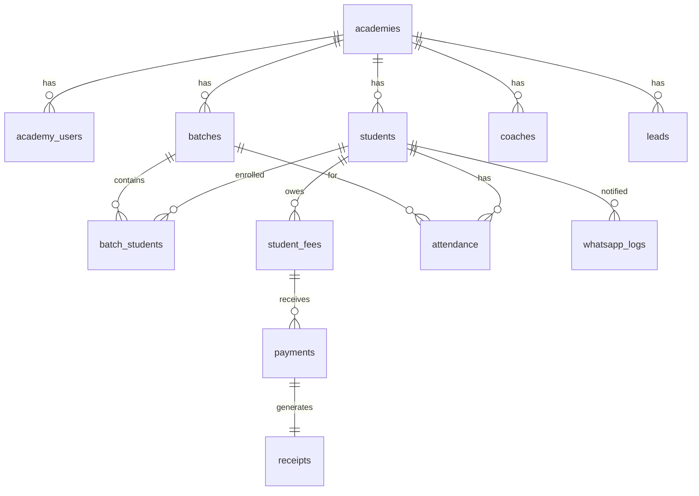

# Internal Build PRD

## Sports Academy Management Platform

**Document type:** Internal execution specification  
**Companion document:** `prd.md` (client-facing scope and vision)  
**Audience:** Developers, QA, technical lead  
**Rule:** If `prd.md` and this document conflict on behavior, this document wins for implementation.

---

## 1. Build Priority

Build in this order. Do not start Advanced Scope modules until Core Scope acceptance criteria pass.

```
1. Multi-tenant + Auth + RLS skeleton
2. Academy setup
3. Students + Batches + Coaches + Staff
4. Excel import (students, batches, pending fees)
5. Attendance
6. Fees + Payments + Receipts
7. WhatsApp (click-to-send + logs)
8. Dashboard + Core reports
9. Leads + trial conversion
10. Advanced Scope modules (per prd.md Section 5)
```

---

## 2. Core Operating Loop — Detailed Journeys

### Journey A: Lead to Student (Core)

```
Public form / manual entry → Lead (New enquiry)
  → Staff contacts → (Contacted)
  → Trial booked → (Trial booked)
  → Trial attended → (Trial attended)
  → Convert to student → Student created + batch assigned
  → Lead status = Converted
```

| Step | Actor | System action |
|------|-------|---------------|
| 1 | Staff/Admin | Create lead with mobile, sport, source |
| 2 | Staff | Update status, add follow-up notes |
| 3 | Staff | Set trial class date |
| 4 | Staff | Mark trial attended |
| 5 | Staff | Click "Convert to student" — pre-fills name, parent, mobile, sport |
| 6 | System | Creates `students` row, links to batch, sets lead `converted` |

**On convert:** `leads.converted_student_id` = new student ID. Lead is not deleted.

---

### Journey B: Daily Attendance (Core)

```
Staff opens Attendance → Selects batch → Selects date (default: today)
  → Sees student list → Marks Present/Absent → Saves
  → System records marked_by, marked_at per student
```

| Rule | Behavior |
|------|----------|
| Default date | Today (academy timezone: Asia/Kolkata) |
| Same-day edit | Staff can edit without admin |
| Past date edit | Admin only; audit log entry |
| Duplicate mark | Upsert — last save wins; log in audit if value changed |

---

### Journey C: Fee to Receipt to WhatsApp (Core — Money Path)

```
Admin/Staff creates fee demand → Student has Pending fee
  → Staff collects payment (full or partial)
  → System updates fee status
  → Receipt PDF generated with unique number
  → Staff shares receipt via WhatsApp (click-to-send)
  → whatsapp_logs row created
  → Owner dashboard reflects collection
```

| Step | Actor | System action |
|------|-------|---------------|
| 1 | Admin/Staff | Create fee: student, type, amount, due date |
| 2 | System | Status = Pending; pending_amount = amount - discount |
| 3 | Staff | Enter payment amount + mode |
| 4 | System | If amount > pending → reject. Else update paid/pending, set status |
| 5 | System | Generate receipt number via edge function (atomic) |
| 6 | System | Create `payments` + `receipts` rows; link to `student_fees` |
| 7 | Staff | Click "Send WhatsApp" → opens wa.me with template text |
| 8 | System | Log message as `manual_sent` in `whatsapp_logs` |

---

### Journey D: Overdue Fee Reminder (Core manual / Advanced auto)

**Core (manual):**
```
Staff views Pending/Overdue fees → Selects student → Click "Send Reminder"
  → Click-to-send WhatsApp with variables filled → Log created
```

**Advanced (automated):**
```
Cron job `send-fee-reminders` runs daily
  → Finds fees where due_date < today AND status IN (Pending, Partially Paid)
  → Sends API template per academy settings
  → Logs success/failure; failed rows available for manual resend
```

---

### Journey E: Owner Morning Check (Core dashboard / Advanced digest)

**Core:** Owner logs in → Dashboard shows yesterday/today collection, pending, overdue, attendance.

**Advanced:** Cron `send-owner-digest` sends WhatsApp/email summary at configured time.

---

### Journey F: Excel Onboarding (Core)

```
Admin downloads template → Fills students/batches/fees in Excel
  → Uploads → System parses and validates
  → Preview screen shows valid rows + errors
  → Admin confirms → Rows inserted
  → Duplicate mobile warns and skips (or overwrites per admin choice)
```

---

## 3. Role × Module Permission Matrix

| Module | Admin | Staff | Coach | Owner |
|--------|-------|-------|-------|-------|
| Academy settings | CRUD | — | — | R |
| User management | CRUD | — | — | — |
| Students | CRUD | CRU | R† | R |
| Leads | CRUD | CRU | — | R |
| Batches | CRUD | R | R‡ | R |
| Attendance (students) | CRUD | CRU§ | CRU‡ | R |
| Attendance (staff) | CRUD | R | — | R |
| Fees | CRUD | CRU | — | R |
| Payments | CRUD | CR | — | R |
| Receipts | CRUD | CR | — | R |
| Cancel payment/fee | Yes | No | No | No |
| Past attendance edit | Yes | No | No | No |
| Coaches | CRUD | R | R (self) | R |
| Staff | CRUD | R (self) | — | R |
| Reports | All | Basic | Assigned only | All |
| WhatsApp send | Yes | Yes | Limited¶ | Digest only |
| WhatsApp templates | CRUD | R | — | — |
| Documents | CRUD | CRU | R† | — |
| Dashboard | Full | Limited | Limited | Full |
| Audit logs | R | — | — | R |
| Excel import | Yes | No | No | No |
| 1:1 Training | CRUD | R | CRU‡ | R |
| ID cards | CRUD | R | — | R |
| Inventory | CRUD | CRU | — | R |
| Public form config | CRUD | — | — | — |

**Legend:** C=Create, R=Read, U=Update, D=Delete  
† Coach: assigned students only  
‡ Coach: assigned batches only  
§ Staff: same-day attendance only without admin  
¶ Coach: session-related messages for assigned students only  
Owner without Admin role: read-only on all operational modules.

---

## 4. Business Rules — Implementation Spec

### 4.1 Fee Rules

```text
CREATE FEE
  - Required: student_id, fee_type_id, amount, due_date, academy_id
  - Optional: discount (default 0), late_fee, notes
  - pending_amount = amount - discount
  - status = 'pending'
  - paid_amount = 0

BULK CREATE
  - Admin selects batch + fee type + amount + due date
  - Creates one student_fees row per active student in batch
  - Skips students who already have same fee_type + due_date (warn in UI)

PARTIAL PAYMENT
  - paid_amount += payment_amount
  - pending_amount = (amount - discount) - paid_amount
  - If pending_amount = 0 → status = 'paid'
  - If 0 < pending_amount < total → status = 'partially_paid'
  - If pending_amount < 0 → REJECT (never allow)

OVERDUE
  - Daily cron OR on-read: if due_date < today AND status IN ('pending','partially_paid')
    → status = 'overdue'
  - Paid and cancelled fees are never marked overdue

CANCEL FEE
  - Admin only
  - Only if no payments OR all payments already cancelled
  - status = 'cancelled'
  - Audit log required

LATE FEE
  - Optional per academy setting
  - If enabled: apply fixed amount or percentage when status becomes overdue
  - Late fee added to pending_amount (document formula in academy_settings)
```

### 4.2 Payment Rules

```text
CREATE PAYMENT
  - Required: student_fee_id, amount, payment_mode, collected_by
  - amount must be > 0
  - amount must be <= student_fees.pending_amount
  - On success: update student_fees paid/pending/status
  - Trigger receipt generation

CANCEL PAYMENT
  - Admin only
  - Reverses paid_amount on linked student_fee
  - Recalculates status (may return to pending/partially_paid/overdue)
  - Receipt status = 'cancelled' (receipt number NOT reused)
  - Audit log required with reason
```

### 4.3 Receipt Rules

```text
FORMAT: {PREFIX}-{FY}-{SEQUENCE}
  - PREFIX: from academy_settings.receipt_prefix (e.g. KCA)
  - FY: financial year Apr–Mar, e.g. 2026 for Apr 2026 – Mar 2027
  - SEQUENCE: zero-padded 4 digits, per academy per FY, atomic increment

GENERATION
  - One receipt per payment (1:1)
  - Edge function generate-receipt-number uses DB transaction / advisory lock
  - Cancelled receipts: sequence not reused; receipt row kept with status cancelled

PDF CONTENT
  - Academy logo, name, address
  - Receipt number, date
  - Student name, ID, parent name
  - Fee type, amount paid, payment mode
  - Balance pending (from student_fees.pending_amount after this payment)
  - Collected by name
  - Optional: GST line if academy_settings.gst_number present
```

### 4.4 Attendance Rules

```text
UNIQUE CONSTRAINT: (academy_id, batch_id, student_id, attendance_date)

CREATE/UPDATE
  - status: 'present' | 'absent' | 'late'
  - marked_by = auth.uid()
  - marked_at = now()

EDIT PERMISSION
  - attendance_date = today → staff, admin, coach (assigned batch)
  - attendance_date < today → admin only
  - Audit log on past-date edit

BATCH DEACTIVATED
  - Cannot mark new attendance; historical records remain readable
```

### 4.5 Lead Rules

```text
STATUSES: new_enquiry | contacted | trial_booked | trial_attended |
          follow_up_pending | converted | lost

CONVERT
  - Creates student with mapped fields
  - lead.status = 'converted'
  - lead.converted_student_id = students.id
  - lead.converted_at = now()

DUPLICATE MOBILE
  - On create/import: if mobile exists in students OR leads (non-lost)
    → show warning with link to existing record
  - Do not hard-block unless academy setting enforce_unique_mobile = true
```

### 4.6 WhatsApp Rules

```text
CLICK-TO-SEND (Core — always implemented)
  - Build message from template + variable substitution
  - URL: https://wa.me/{whatsapp_number}?text={encoded_message}
  - Log: status = 'manual_sent', channel = 'click_to_send'

API SEND (Advanced)
  - Edge function: send-whatsapp-message
  - Requires: academy whatsapp_bsp_config (API key server-side only)
  - Uses approved template name + variable array
  - On success: status = 'sent'
  - On failure: status = 'failed', failure_reason stored
  - UI shows "Resend manually" button → falls back to click-to-send

VARIABLE SUBSTITUTION
  - Replace {student_name}, {pending_amount}, etc. before send
  - Missing variable → block send, show error

LOGGING (mandatory for both methods)
  - whatsapp_logs: academy_id, recipient, message_type, body, status,
    sent_at, failure_reason, triggered_by, student_id (nullable)
```

### 4.7 Excel Import Rules

```text
STUDENTS TEMPLATE COLUMNS
  student_name*, parent_name*, mobile*, whatsapp, dob, gender, address,
  sport, batch_name, joining_date, emergency_contact_name, emergency_contact_number

BATCHES TEMPLATE COLUMNS
  batch_name*, sport*, session_type, start_time, end_time, capacity,
  days_of_week, coach_mobile, fee_amount

PENDING FEES TEMPLATE COLUMNS
  student_id_or_mobile*, fee_type*, amount*, due_date*, discount

VALIDATION
  - Required fields marked with *
  - mobile: 10 digits, Indian format
  - batch_name must exist OR create batch flag (admin option)
  - fee_type must match academy fee_types

FLOW
  1. Upload → parse (xlsx/csv)
  2. Validate all rows → return { valid: [], errors: [{row, field, message}] }
  3. Preview UI
  4. On confirm → insert in transaction; rollback all on critical error
  5. Import log row: imported_by, counts, timestamp
```

---

## 5. Data Model — Tables, FKs, Uniqueness, Indexes

### 5.1 Entity Relationship (Core)



### 5.2 Table Definitions (Core)

#### academies
| Column | Type | Notes |
|--------|------|-------|
| id | uuid PK | |
| name | text NOT NULL | |
| slug | text UNIQUE | for public form URL |
| is_active | boolean DEFAULT true | |

#### academy_settings
| Column | Type | Notes |
|--------|------|-------|
| id | uuid PK | |
| academy_id | uuid FK → academies UNIQUE | |
| receipt_prefix | text NOT NULL | e.g. KCA |
| default_currency | text DEFAULT 'INR' | |
| timezone | text DEFAULT 'Asia/Kolkata' | |
| gst_number | text NULL | |
| google_review_link | text NULL | |
| brand_color | text NULL | |
| logo_url | text NULL | storage path |

#### academy_users
| Column | Type | Notes |
|--------|------|-------|
| id | uuid PK | |
| academy_id | uuid FK → academies | |
| user_id | uuid FK → auth.users | |
| role | enum | admin, staff, coach, owner |
| is_active | boolean DEFAULT true | |
| **UNIQUE** | (academy_id, user_id) | |

#### students
| Column | Type | Notes |
|--------|------|-------|
| id | uuid PK | |
| academy_id | uuid FK → academies | |
| student_code | text NOT NULL | auto-generated display ID |
| name | text NOT NULL | |
| parent_name | text NOT NULL | |
| mobile | text NOT NULL | |
| whatsapp | text NULL | defaults to mobile |
| dob | date NULL | |
| gender | text NULL | |
| address | text NULL | |
| sport_id | uuid FK → sports NULL | |
| status | enum | active, inactive |
| joining_date | date | |
| emergency_contact_name | text NULL | |
| emergency_contact_number | text NULL | |
| medical_notes | text NULL | |
| profile_photo_url | text NULL | |
| **UNIQUE** | (academy_id, student_code) | |
| **INDEX** | (academy_id, mobile) | |
| **INDEX** | (academy_id, name) | |

#### batches
| Column | Type | Notes |
|--------|------|-------|
| id | uuid PK | |
| academy_id | uuid FK | |
| name | text NOT NULL | |
| sport_id | uuid FK → sports | |
| coach_id | uuid FK → coaches NULL | |
| capacity | int | |
| start_time | time | |
| end_time | time | |
| days_of_week | int[] | 0=Sun..6=Sat |
| reference_fee | numeric NULL | optional display only |
| is_active | boolean DEFAULT true | |
| **UNIQUE** | (academy_id, name) | |

#### batch_students
| Column | Type | Notes |
|--------|------|-------|
| id | uuid PK | |
| academy_id | uuid FK | |
| batch_id | uuid FK → batches | |
| student_id | uuid FK → students | |
| joined_at | date | |
| is_active | boolean DEFAULT true | |
| **UNIQUE** | (batch_id, student_id) WHERE is_active | one active batch per pair |

#### student_fees
| Column | Type | Notes |
|--------|------|-------|
| id | uuid PK | |
| academy_id | uuid FK | |
| student_id | uuid FK → students | |
| fee_type_id | uuid FK → fee_types | |
| amount | numeric NOT NULL | |
| discount | numeric DEFAULT 0 | |
| late_fee | numeric DEFAULT 0 | |
| paid_amount | numeric DEFAULT 0 | |
| pending_amount | numeric NOT NULL | |
| due_date | date NOT NULL | |
| status | enum | pending, partially_paid, paid, overdue, cancelled |
| **INDEX** | (academy_id, status, due_date) | for overdue queries |
| **INDEX** | (student_id, status) | |

#### payments
| Column | Type | Notes |
|--------|------|-------|
| id | uuid PK | |
| academy_id | uuid FK | |
| student_fee_id | uuid FK → student_fees | |
| amount | numeric NOT NULL | |
| payment_mode | enum | cash, upi, bank_transfer, online, cheque, other |
| payment_date | date NOT NULL | |
| collected_by | uuid FK → academy_users | |
| status | enum | active, cancelled |
| notes | text NULL | |

#### receipts
| Column | Type | Notes |
|--------|------|-------|
| id | uuid PK | |
| academy_id | uuid FK | |
| payment_id | uuid FK → payments UNIQUE | |
| receipt_number | text NOT NULL | |
| pdf_url | text NULL | storage path |
| status | enum | active, cancelled |
| **UNIQUE** | (academy_id, receipt_number) | |

#### receipt_sequences
| Column | Type | Notes |
|--------|------|-------|
| academy_id | uuid FK | |
| financial_year | int | e.g. 2026 |
| last_sequence | int DEFAULT 0 | |
| **UNIQUE** | (academy_id, financial_year) | |

#### attendance
| Column | Type | Notes |
|--------|------|-------|
| id | uuid PK | |
| academy_id | uuid FK | |
| batch_id | uuid FK → batches | |
| student_id | uuid FK → students | |
| attendance_date | date NOT NULL | |
| status | enum | present, absent, late |
| remarks | text NULL | |
| marked_by | uuid FK → academy_users | |
| marked_at | timestamptz | |
| **UNIQUE** | (academy_id, batch_id, student_id, attendance_date) | |

#### leads
| Column | Type | Notes |
|--------|------|-------|
| id | uuid PK | |
| academy_id | uuid FK | |
| name | text | |
| parent_name | text | |
| mobile | text | |
| status | enum | see 4.5 |
| converted_student_id | uuid FK → students NULL | |
| source | text NULL | |
| trial_date | date NULL | |
| assigned_staff_id | uuid FK NULL | |

#### whatsapp_logs
| Column | Type | Notes |
|--------|------|-------|
| id | uuid PK | |
| academy_id | uuid FK | |
| student_id | uuid FK NULL | |
| recipient | text | phone number |
| message_type | text | |
| body | text | |
| channel | enum | click_to_send, api |
| status | enum | manual_sent, sent, failed |
| failure_reason | text NULL | |
| triggered_by | uuid FK | |
| sent_at | timestamptz | |

#### audit_logs
| Column | Type | Notes |
|--------|------|-------|
| id | uuid PK | |
| academy_id | uuid FK | |
| user_id | uuid FK | |
| action | text | |
| entity_type | text | |
| entity_id | uuid | |
| old_value | jsonb NULL | |
| new_value | jsonb NULL | |
| ip_address | text NULL | |
| created_at | timestamptz | |

### 5.3 Common Columns (all academy tables)

```text
id            uuid PRIMARY KEY DEFAULT gen_random_uuid()
academy_id    uuid NOT NULL REFERENCES academies(id)
branch_id     uuid NULL  -- reserved, unused at launch
created_by    uuid NULL REFERENCES auth.users(id)
created_at    timestamptz DEFAULT now()
updated_at    timestamptz DEFAULT now()
is_active     boolean DEFAULT true
```

### 5.4 Financial Year Helper

```text
FY starts April 1.
If month >= 4: FY = current year
Else: FY = current year - 1
Example: 15 Mar 2026 → FY 2025; 1 Apr 2026 → FY 2026
```

---

## 6. RLS Policy Matrix

Apply on all tables with `academy_id`.

| Policy | Rule |
|--------|------|
| `academy_isolation` | `academy_id = (SELECT academy_id FROM academy_users WHERE user_id = auth.uid() AND is_active)` |
| `admin_all` | role = admin → full CRUD on academy rows |
| `staff_students` | staff → CRU on students, no delete |
| `staff_fees` | staff → CRU on fees/payments; no cancel |
| `coach_attendance` | coach → U on attendance where batch.coach_id = coach.id |
| `coach_read` | coach → R on assigned batch students only |
| `owner_read` | owner → SELECT all academy rows |
| `public_lead_insert` | anon → INSERT on leads only, with academy_id from form token/slug |

**Storage policies:** Private bucket per academy path `{academy_id}/{entity}/{file}`. Signed URL via `generate-signed-document-url` edge function. TTL 60 seconds default.

---

## 7. Edge Functions

| Function | Scope | Purpose |
|----------|-------|---------|
| `generate-receipt-number` | Core | Atomic sequence increment, return formatted number |
| `generate-receipt-pdf` | Core | Render PDF, upload to storage, return path |
| `send-whatsapp-message` | Advanced | BSP API send |
| `send-fee-reminders` | Advanced | Cron: overdue/due reminders |
| `send-owner-digest` | Advanced | Cron: daily owner summary |
| `send-birthday-wishes` | Advanced | Cron |
| `send-session-reminders` | Advanced | Cron |
| `generate-signed-document-url` | Core | Private file access |
| `bulk-message-dispatcher` | Advanced | Batch WhatsApp |
| `payment-webhook-handler` | Future | Payment gateway |

**Security:** All functions validate JWT or service role. API keys in Supabase secrets only.

---

## 8. Scheduled Jobs

| Job | Scope | Schedule | Action |
|-----|-------|----------|--------|
| `mark-overdue-fees` | Core | Daily 00:30 IST | Update fee statuses |
| `send-fee-reminders` | Advanced | Daily 09:00 IST | API reminders |
| `send-owner-digest` | Advanced | Daily 20:00 IST | Owner summary |
| `send-birthday-wishes` | Advanced | Daily 08:00 IST | |
| `send-session-reminders` | Advanced | Daily 18:00 IST | Next-day sessions |

Each job writes to `job_logs` (job_name, run_at, success_count, fail_count, errors jsonb). Failed rows retry once after 1 hour.

---

## 9. UI Build Notes

### Mobile-first screens (build and test at 375px first)

1. **Mark Attendance** — batch picker → student checklist → save
2. **Collect Fee** — student search → pending fees → amount + mode → pay → receipt
3. **Send WhatsApp** — from fee/receipt screen, one tap
4. **Student Search** — global search in header

### Navigation (desktop sidebar / mobile bottom bar)

```
Dashboard | Students | Attendance | Fees | More
```

"More" drawer: Leads, Batches, Receipts, Reports, Coaches, Staff, Settings.

---

## 10. Acceptance Criteria — Given/When/Then

### AC-01: Academy isolation
- **Given** User A belongs to Academy 1 and User B belongs to Academy 2
- **When** User A requests students list
- **Then** only Academy 1 students are returned; zero rows from Academy 2

### AC-02: Student creation
- **Given** Admin is logged in with valid academy
- **When** Admin submits student form with required fields
- **Then** student is created with auto-generated `student_code` unique within academy

### AC-03: Batch assignment
- **Given** Active student and active batch in same academy
- **When** Admin assigns student to batch
- **Then** `batch_students` row created; batch capacity count increases

### AC-04: Mark attendance (today)
- **Given** Staff is assigned to academy with batch containing 10 students
- **When** Staff marks 8 present, 2 absent for today and saves
- **Then** 10 attendance rows exist with correct status, `marked_by` = staff user, `marked_at` set

### AC-05: Attendance duplicate prevention
- **Given** Attendance already marked for student X, batch Y, date Z
- **When** Staff marks again with different status
- **Then** existing row is updated (not duplicated)

### AC-06: Past attendance edit blocked for staff
- **Given** Attendance exists for yesterday
- **When** Staff attempts to edit
- **Then** action is denied with permission error

### AC-07: Past attendance edit allowed for admin
- **Given** Attendance exists for yesterday
- **When** Admin edits status
- **Then** row updates and audit_log entry created

### AC-08: Create fee demand
- **Given** Active student
- **When** Staff creates fee amount ₹3000, due date future
- **Then** `student_fees` status = pending, pending_amount = 3000, paid_amount = 0

### AC-09: Full payment
- **Given** Pending fee ₹3000
- **When** Staff collects ₹3000 via UPI
- **Then** status = paid, pending_amount = 0, receipt generated

### AC-10: Partial payment
- **Given** Pending fee ₹3000
- **When** Staff collects ₹1500
- **Then** status = partially_paid, pending_amount = 1500, receipt shows balance pending ₹1500

### AC-11: Overpayment blocked
- **Given** Pending fee with pending_amount ₹1500
- **When** Staff enters payment ₹2000
- **Then** payment rejected; error "Amount exceeds pending balance"; no receipt

### AC-12: Overdue status
- **Given** Fee with due_date yesterday and status pending
- **When** Overdue job runs OR fee list is loaded
- **Then** status = overdue

### AC-13: Receipt number uniqueness
- **Given** Academy prefix KCA, FY 2026, last sequence 5
- **When** Next receipt is generated
- **Then** receipt_number = KCA-2026-0006; unique constraint holds under concurrent requests

### AC-14: Cancelled receipt not reused
- **Given** Receipt KCA-2026-0006 is cancelled
- **When** Next receipt is generated
- **Then** receipt_number = KCA-2026-0007 (not 0006)

### AC-15: Cancel payment (admin)
- **Given** Paid fee with active payment and receipt
- **When** Admin cancels payment with reason
- **Then** fee status recalculated, receipt status = cancelled, audit log created

### AC-16: WhatsApp click-to-send
- **Given** Student with WhatsApp number and pending fee
- **When** Staff clicks Send Reminder
- **Then** wa.me link opens with populated message; whatsapp_logs row with status manual_sent

### AC-17: WhatsApp API failure fallback
- **Given** API send configured and API returns error
- **When** Send is attempted
- **Then** log status = failed with reason; UI shows manual resend option

### AC-18: Lead conversion
- **Given** Lead with status trial_attended
- **When** Staff converts to student and selects batch
- **Then** student created, lead status = converted, converted_student_id set

### AC-19: Excel import students
- **Given** Valid Excel with 50 students, 2 rows missing mobile
- **When** Admin uploads and confirms
- **Then** 48 imported, 2 errors shown with row numbers; import log created

### AC-20: Excel import duplicate mobile
- **Given** Student exists with mobile 9876543210
- **When** Import row has same mobile
- **Then** row flagged as duplicate in preview; skipped on import unless overwrite enabled

### AC-21: Coach batch restriction
- **Given** Coach assigned to Batch A only
- **When** Coach views attendance
- **Then** only Batch A appears; Batch B not accessible

### AC-22: Owner dashboard
- **Given** Owner role user
- **When** Dashboard loads
- **Then** shows today's collection, pending fees total, overdue fees total, today's attendance count

### AC-23: Staff cannot cancel fee
- **Given** Staff user and pending fee
- **When** Staff attempts cancel fee
- **Then** action denied

### AC-24: Bulk fee per batch
- **Given** Batch with 20 active students
- **When** Admin bulk creates monthly fee ₹2000 due 1st next month
- **Then** 20 student_fees rows created

### AC-25: Public enquiry form
- **Given** Public form URL for academy slug
- **When** Anonymous user submits valid form
- **Then** lead created with status new_enquiry; no other data exposed

### AC-26: Document private access
- **Given** Student document uploaded
- **When** Unauthenticated user hits storage URL directly
- **Then** access denied; signed URL required

### AC-27: Inactive user login blocked
- **Given** User with is_active = false
- **When** Login attempted
- **Then** authentication fails with appropriate message

### AC-28: Receipt PDF content
- **Given** Partial payment ₹1500 on ₹3000 fee
- **When** Receipt PDF generated
- **Then** PDF shows paid ₹1500, balance pending ₹1500, correct receipt number

### AC-29: Global search
- **Given** Student "Arjun Kumar" with parent mobile 9876543210
- **When** Staff searches "Arjun" or "9876543210"
- **Then** student appears in results

### AC-30: Report export
- **Given** Fee collection data for date range
- **When** Admin exports financial report
- **Then** Excel file downloads with correct totals matching dashboard

---

## 11. Out of Scope for Build (unless ticket approved)

- Offline attendance sync
- Full Aadhaar storage
- Payroll
- Payment reconciliation
- QR scan attendance flow
- Video hosting
- Native apps

---

## 12. Definition of Done (per feature)

- [ ] RLS policies written and tested with all 4 roles
- [ ] Mobile viewport tested at 375px
- [ ] Audit log on sensitive mutations
- [ ] Loading and error states in UI
- [ ] Acceptance criteria for module pass in QA
- [ ] No API keys in client bundle

---

## 13. Open Questions (resolve before build)

| # | Question | Default if no answer |
|---|----------|----------------------|
| 1 | Owner = separate login or Admin dual role? | Same person can have owner + admin roles |
| 2 | One student, multiple active batches? | No — one active batch at a time |
| 3 | Late fee formula | Fixed ₹ per day after due date; off by default |
| 4 | WhatsApp BSP vendor | Client provides; build adapter interface |
| 5 | Receipt PDF signature image | Optional upload in academy settings |

---

*End of Internal Build PRD*
