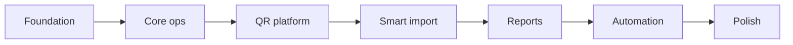

Your answers lock in a clear product direction. Here is the **rethought Pro delivery plan** — owner-first, QR as a platform (not just ID cards), smart import, full scope, no cuts.

---

## Product north star

**Owners should feel:** *“Parents scan at the gate, attendance is done, fees are visible, and I get one WhatsApp summary without chasing anyone.”*

Pro is not “more buttons.” It is **less staff friction + more trust + proof**.

---

## Your decisions (locked)

| # | Choice |
|---|--------|
| Billing | Manual `plan` on academy (you set when they pay) |
| WhatsApp | Click-to-send only (no BSP/API for v1) |
| Digest | WhatsApp only (pre-filled link, owner taps send) |
| Excel | Smart import — adapts to what they upload |
| Coach login | Required in v1 |
| Starter limits | 150 students · 3 users · 6 batches · 1 sport |
| QR | Pro platform: attendance + ID + more |
| Scope | Full Pro card — nothing dropped |

---

## The QR platform (Pro centerpiece)

Think of QR as **one identity layer** with multiple “actions” behind it — not separate features.

### 1. Student identity QR (foundation)

Every active student gets a **signed, academy-scoped token** (not guessable `STU-0001` in the URL).

- Printed on **ID card** (PDF bulk generate)
- **Digital card** link shareable on WhatsApp (“Save this for check-in”)
- Regeneratable if lost (admin action → old token invalidated → audit log)

**Owner win:** Professional IDs + one code for everything below.

---

### 2. Self check-in attendance (the wow feature)

**Flow (no app install — mobile web only):**

```
Scan QR (ID card or WhatsApp link)
  → Confirm student photo + name
  → Shows today's eligible batch(es) based on schedule
  → Tap "Mark present"
  → Success screen + optional WhatsApp confirmation to parent
```

**Rules (configurable in Settings):**

| Rule | Default | Why |
|------|---------|-----|
| Time window | 30 min before batch start → 15 min after end | Stops midnight fake check-ins |
| One check-in per batch per day | On | Duplicate = upsert with audit |
| Optional PIN | Last 4 digits of registered mobile | Stops buddy scanning |
| Optional geofence | Within ~200 m of academy pin | Stops remote scans (uses browser location; academy sets map pin once) |

**Data:**

- `attendance.source = 'qr_scan'` (vs `manual` / `coach`)
- `qr_scan_logs`: student, batch, time, device hint, success/fail reason

**Owner dashboard additions:**

- “**42 QR check-ins today** · 8 manual by coaches”
- Live counter (Supabase Realtime on `attendance`)
- Absent list still shows who **didn’t** scan by batch end

**Owner happiness:** No register, no “coach forgot to mark,” parents see instant confirmation. You sell this on demos.

---

### 3. Academy / batch kiosk QR (entrance poster)

One QR per batch at the ground:

```
Scan poster → Enter student code OR scan personal ID
  → Same check-in rules
```

Good when kids don’t carry cards yet (first week of season).

---

### 4. Trial & lead check-in (growth loop)

Trial student gets WhatsApp link before trial day:

- Scan → confirms lead → status → `trial_attended`
- Optional one-off attendance row for trial batch
- Staff gets “3 trials checked in today” on dashboard

**Owner win:** Conversion funnel is automatic, not “did they show up?” in a notebook.

---

### 5. Receipt verification QR (trust)

On every PDF receipt:

- Scan → public verify page: paid amount, date, receipt #, academy name
- No fee amounts history exposed — only that receipt

**Owner win:** Fewer “I already paid” arguments; parents trust printed/WhatsApp receipts.

---

### 6. Coach scan shortcut (coach login v1)

Coach scans **batch QR** while logged in:

- Opens attendance sheet for that batch, today pre-selected
- Can override/fix a QR check-in (with audit: who changed what)

**Owner win:** Coaches fast on the ground; owner still has audit trail.

---

### 7. Emergency strip (staff-only, optional)

Scan ID as **staff/admin**:

- Emergency contact, medical notes (not public parent view)
- Parent public scan does **not** show medical data

---

### QR summary for owners (how you pitch it)

| Use | Who scans | Result |
|-----|-----------|--------|
| Daily attendance | Student/parent | Auto present, parent peace of mind |
| Trial day | Prospect | Lead status + trial proof |
| Receipt | Parent/skeptic | Payment verified |
| Batch poster | Anyone at gate | Check-in without personal card |
| Coach batch QR | Coach | Faster manual attendance |
| ID card | Identity | One card, all flows |

This goes **beyond** what most academy software offers at ₹10k/mo — and it matches your “owners should feel very happy” goal.

---

## Smart Excel import (Pro way — yes, we can)

Not a fixed template only. **Upload what they have; we adapt.**

### How it works

```
Upload .xlsx / .csv (any layout)
  → Detect sheets & header row
  → Auto-classify: students | batches | assignments | fees | leads | coaches
  → Column mapper (auto-matched, user can fix)
  → Validate (mobile format, duplicates, batch exists, etc.)
  → Preview: valid / warnings / errors
  → Confirm import → write + audit log
```

### Intelligence layers

1. **Sheet detection** — “Sheet1 = students”, “Batches”, “Fees pending”
2. **Column synonyms** — `Name`, `Student Name`, `குழந்தை பெயர்` → `name`; `Mobile`, `Phone`, `Cell` → `mobile`
3. **Relationship linking** — match batch by name if ID missing; link student to batch via mobile + batch name
4. **Duplicate policy** — same mobile in academy → skip / update / ask (admin chooses per import)
5. **Error export** — download rows that failed with reason column (they fix and re-upload)

### Plan gating

| | Starter | Pro |
|---|---------|-----|
| First import | Setup (you do it) | Setup |
| Self-serve import | Blocked | Unlimited |
| Multi-entity in one file | — | Yes |

**Tech:** SheetJS (`xlsx`) + mapping UI + server action / edge function for large files. No AI required for v1 — heuristics + manual mapper is enough and reliable.

---

## Coach login (v1 — non-negotiable per you)

**Model:**

- `academy_users.role = 'coach'` linked to `coaches.id`
- Admin: create coach → invite email → assign batches

**Coach sees only:**

- Dashboard (assigned batches today, attendance %)
- Attendance (assigned batches)
- Students (in assigned batches)
- No fees, no settings, no reports export, no user management

**RLS:** policies use `coach_id` on `batches` + `batch_students` — not optional; enforced in DB, not just UI.

---

## Full delivery roadmap (no cuts)

### Phase 0 — Platform foundation · ~1 week
- `academies.plan` (`starter` | `pro`) + limit constants
- Enforce Starter caps on insert (students, users, batches, sports)
- Role middleware + nav (admin / staff / coach / owner)
- Coach ↔ user ↔ batch linking
- `audit_logs` writer utility
- `attendance.source` column + `qr_scan_logs` table

### Phase 1 — Core ops complete · ~1.5 weeks
- Sports CRUD, staff/coach invite UI
- Leads: full status pipeline + `trial_date` + follow-ups
- Receipt PDF + storage
- WhatsApp click-to-send from fee/receipt
- Google review booster (post-payment WhatsApp CTA using `google_review_link`)

### Phase 2 — QR platform · ~2 weeks
- Signed student tokens + public check-in pages (`/a/[slug]/check-in/...`)
- Check-in rules engine (window, PIN, geofence optional)
- ID card PDF bulk generate (QR embedded)
- Batch kiosk QR + coach batch scan deep link
- Trial check-in link from leads
- Receipt verification QR on PDF
- Dashboard: QR vs manual stats + realtime

### Phase 3 — Smart Excel import · ~1 week
- Upload → detect → map → preview → import
- Pro-only gate; admin override for Starter
- Import audit + error spreadsheet download

### Phase 4 — Reports & export · ~1.5 weeks
- Financial, attendance (incl. QR vs manual split), lead conversion reports
- Filters: date, batch, sport, source
- Excel + PDF export (Pro only)

### Phase 5 — Automation (click-to-send) · ~1.5 weeks
- Cron: `mark_overdue_fees`, build digest snapshots
- Owner digest: dashboard card + one-tap WhatsApp prefill (collection, attendance %, QR count, overdue total, new leads)
- Fee reminders: staff queue “12 parents ready” → individual WhatsApp buttons
- Session / birthday reminders (same click-to-send pattern)
- `job_logs` table per build-prd

### Phase 6 — Pro polish · ~1 week
- Audit logs UI
- Settings: QR toggles, digest time, reminder preferences
- Remove all “soon” placeholders
- Acceptance tests for AC-01 through coach/QR scenarios

**Total: ~9–10 weeks focused** (full Pro, honestly shippable).



Phase 2 (QR) is the demo killer — prioritize right after coach login works.

---

## WhatsApp-only digest (your choice #3)

No email infra. Pattern:

1. **8:00 PM IST cron** → compute digest → save `owner_digest_snapshots`
2. Owner opens app (any time) → banner: **“Send today’s summary on WhatsApp”**
3. One tap → `wa.me` with pre-filled text:

```
Kohinoor Cricket — 16 Jun
Collected: ₹12,400 | Present: 89/102
QR check-ins: 76 | Overdue: ₹18,200 (4 students)
New leads: 2 | Trials attended: 1
```

Same pattern for staff fee reminders — **queue + tap**, not auto-spam (works without API, still feels pro).

---

## Starter vs Pro (enforcement summary)

| | Starter | Pro |
|---|---------|-----|
| Students / staff / batches / sports | Capped | Unlimited |
| Coach logins | Optional later | Yes |
| QR check-in | — | Yes |
| ID cards + verify QR | — | Yes |
| Smart Excel import | Setup only | Anytime |
| Report export | View only | PDF + Excel |
| Digest + reminders | — | Click-to-send queues |
| Audit logs | — | Full |

---

## Landing alignment (later)

When QR ships, add to Pro card:

- “**QR attendance — students scan, present marked automatically**”
- “Digital ID cards with one QR for check-in & verification”

That’s a stronger hook than “advanced fee tracking.”

---

## What I still need from you (minimal)

You’ve answered the big ones. Only these unblock implementation details:

1. **Academy location for geofence** — required on setup, or optional (“skip if not set”)?
2. **Check-in PIN** — default **on** (last 4 of mobile) or **off** for faster scans?
3. **Parent WhatsApp after QR check-in** — send “Rahul checked in at 5:42 PM” automatically (click-to-send prompt to staff) or silent check-in only?
4. **First pilot academy slug** — so we test QR posters and import against real data.

If you don’t care, defaults: geofence optional, PIN on, silent check-in (dashboard only), and we use seed academy for dev.

---

## Bottom line

- **Yes** — smart import based on upload is doable and is the right Pro experience.
- **QR** should be a **platform** (attendance + trial + receipt + coach + ID), not a PDF afterthought.
- **Coach login + RLS** in Phase 0 — everything else builds on it.
- **No scope cut** — 6 phases, ~9–10 weeks, manual billing, WhatsApp click-to-send throughout.