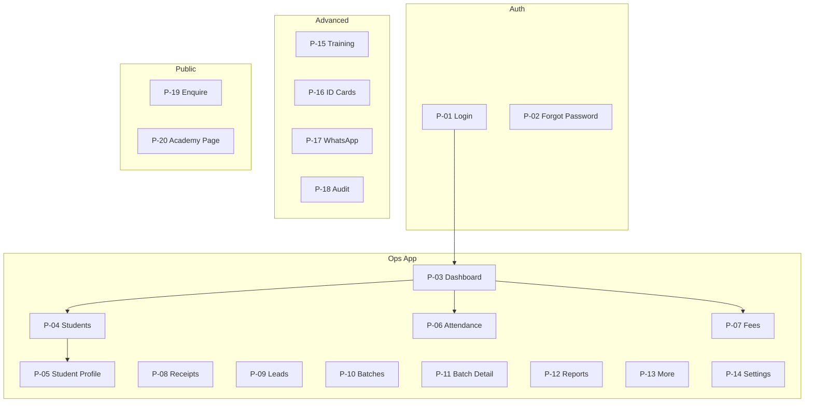

# UI Specification

## Sports Academy Management Platform

**Document type:** UI / Information Architecture / Design System  
**Companion documents:** `prd.md`, `build-prd.md`, `design.md`  
**Stack:** Next.js App Router, shadcn/ui, Tailwind CSS, CSS variables  
**Version:** 2.0

---

## 0. Design Thinking

Before screens, commit to a direction. This product is **not** a marketing site and **not** a gym consumer app.

| Dimension | Decision |
|-----------|----------|
| **Purpose** | Field operations for Indian sports academies — fee recovery, attendance, WhatsApp — on ₹15k Android phones at 7 AM. |
| **Tone** | **Industrial utilitarian, refined.** Confident like premium ops software. Fast, legible, zero decoration for decoration's sake. |
| **Audience** | Non-technical staff (primary), admin/owner (secondary), parents (public surfaces only). |
| **Differentiation** | Real product UI embedded in context — attendance rows, fee chips, receipt previews shown as first-class surfaces, not abstract icons. Academy brand color appears **once** per screen max. |
| **Anti-patterns** | No purple gradients, no glassmorphism, no Inter/Roboto defaults, no emoji-heavy UI, no dashboard widget soup. |

### Two Surfaces, One System

The app has two visual modes sharing tokens but different density:

| Surface | Routes | Character |
|---------|--------|-------------|
| **Ops App** | `/`, `/students`, `/fees`, etc. | White canvas, near-black CTAs, compact cards, thumb-zone actions, status semantics only |
| **Public** | `/a/[slug]`, `/a/[slug]/enquire` | Editorial rhythm from `design.md` — hero band, surface-card sections, dark footer close |

`design.md` is the **token vocabulary** (colors, type scale, elevation, component naming). This doc **applies** it to academy ops and extends it with app-specific components.

---

## 1. Product UI Principles

| Principle | Rule |
|-----------|------|
| **Ground-first** | Design at 375px width first. Desktop is an expansion, not the source. |
| **3-tap money path** | Dashboard → Collect fee → Receipt → WhatsApp in ≤3 taps from home. |
| **One profile, many tabs** | Student / batch / lead = one detail hub with tabs — not separate pages. |
| **Actions in context** | Create/edit in `sheet` or `dialog` — never navigate away from list. |
| **Show the product** | Dashboard stat areas use real row previews (fee list snippet, attendance strip) — not abstract chart icons alone. |
| **Monochrome actions** | Primary CTAs are ink (`#111111`), not brand color. Brand color = wayfinding only. |
| **Semantic color only** | Green/amber/red reserved for Paid/Pending/Overdue/Present/Absent — nowhere else. |
| **Role-aware chrome** | Same shell; nav items and CTAs filter by role. |
| **No parent login** | Parents: WhatsApp, PDF links, public forms only. |

### Scope Tags (unchanged)

| Tag | Meaning |
|-----|---------|
| 🟢 Core | Must ship |
| 🟡 Advanced | After core workflows stable |
| ⚪ Future | Add-on / separately quoted |

---

## 2. Design System Tokens

Use `{token}` references in Figma and code — never inline hex in components.

### 2.1 Colors

#### Brand & Action
| Token | Value | Use |
|-------|-------|-----|
| `{colors.primary}` | `#111111` | Primary CTAs, display headlines, active ink |
| `{colors.primary-active}` | `#242424` | Button pressed state |
| `{colors.brand-accent}` | `var(--academy-brand)` | Nav active indicator, logo ring, **one** accent per screen |
| `{colors.brand-accent-soft}` | `color-mix(in srgb, var(--academy-brand) 12%, white)` | Selected row wash, focus ring |

**Academy brand default:** `#0F766E` (teal). Owner sets in Settings → injected as `--academy-brand` on `:root`.

#### Surfaces
| Token | Value | Use |
|-------|-------|-----|
| `{colors.canvas}` | `#ffffff` | Page floor, input fill, sheet background |
| `{colors.surface-soft}` | `#f8f9fa` | Nav-pill-group wrapper, sidebar hover |
| `{colors.surface-card}` | `#f5f5f5` | Stat cards, student row hover, filter bar |
| `{colors.surface-strong}` | `#e5e7eb` | Disabled buttons, dividers |
| `{colors.surface-dark}` | `#101010` | Public footer only; owner summary strip (desktop) |
| `{colors.surface-dark-elevated}` | `#1a1a1a` | Nested cards inside dark strip |
| `{colors.hairline}` | `#e5e7eb` | Input borders, table rules |
| `{colors.hairline-soft}` | `#f3f4f6` | Section separators on white |

#### Text
| Token | Value | Use |
|-------|-------|-----|
| `{colors.ink}` | `#111111` | Headlines, primary labels |
| `{colors.body}` | `#374151` | Body copy, table cells |
| `{colors.muted}` | `#6b7280` | Secondary labels, metadata |
| `{colors.muted-soft}` | `#9ca3af` | Placeholders, captions |
| `{colors.on-primary}` | `#ffffff` | Text on primary button |
| `{colors.on-dark}` | `#ffffff` | Text on dark surfaces |
| `{colors.on-dark-soft}` | `#a1a1aa` | Public footer links |

#### Semantic (status only — never on CTAs)
| Token | Value | Use |
|-------|-------|-----|
| `{colors.success}` | `#10b981` | Paid, Present |
| `{colors.success-soft}` | `#d1fae5` | Success badge background |
| `{colors.warning}` | `#f59e0b` | Partial, Late |
| `{colors.warning-soft}` | `#fef3c7` | Warning badge background |
| `{colors.error}` | `#ef4444` | Overdue, Absent, validation |
| `{colors.error-soft}` | `#fee2e2` | Error badge background |
| `{colors.neutral}` | `#6b7280` | Pending, Cancelled |

#### Sport Badge Pastels (avatars, sport tags only)
| Token | Value |
|-------|-------|
| `{colors.badge-cricket}` | `#fb923c` |
| `{colors.badge-football}` | `#34d399` |
| `{colors.badge-tennis}` | `#8b5cf6` |
| `{colors.badge-swim}` | `#38bdf8` |

### 2.2 Typography

**Split is strict** — same discipline as `design.md`:

| Role | Family | Fallback |
|------|--------|----------|
| **Display** | `Bricolage Grotesque` | `Segoe UI`, sans-serif |
| **UI / Body** | `Geist Sans` | system-ui, sans-serif |
| **Tabular** | `Geist Mono` | monospace — student IDs, receipt numbers, amounts |

```css
/* globals.css */
--font-display: 'Bricolage Grotesque', sans-serif;
--font-body: 'Geist Sans', system-ui, sans-serif;
--font-mono: 'Geist Mono', monospace;
```

#### Type Scale

| Token | Size | Weight | Tracking | Font | Use |
|-------|------|--------|----------|------|-----|
| `{type.display-lg}` | 32px | 600 | -1px | Display | Page titles (mobile) |
| `{type.display-md}` | 24px | 600 | -0.5px | Display | Page titles (desktop), sheet headers |
| `{type.display-sm}` | 20px | 600 | -0.3px | Display | Stat card values (₹ amounts) |
| `{type.title-lg}` | 18px | 600 | 0 | Body | Student name in profile header |
| `{type.title-md}` | 16px | 600 | 0 | Body | Card titles, batch names |
| `{type.title-sm}` | 14px | 600 | 0 | Body | List row primary |
| `{type.body-md}` | 16px | 400 | 0 | Body | Form labels, descriptions |
| `{type.body-sm}` | 14px | 400 | 0 | Body | Table cells, metadata |
| `{type.caption}` | 12px | 500 | 0.02em | Body | Badges, timestamps |
| `{type.mono-sm}` | 13px | 500 | 0 | Mono | KCA-0042, KCA-2026-0001 |
| `{type.button}` | 14px | 600 | 0 | Body | All button labels |
| `{type.nav}` | 14px | 500 | 0 | Body | Sidebar, bottom nav |

**Rules:**
- Display font **only** for page titles and stat values — never body paragraphs.
- Amounts and IDs always `{type.mono-sm}` or `{type.display-sm}` for scanability.
- Display weight stays **600** — never 700.

### 2.3 Spacing

Base unit: **4px**.

| Token | Value | Use |
|-------|-------|-----|
| `{space.xxs}` | 4px | Icon gaps |
| `{space.xs}` | 8px | Chip padding, inline gaps |
| `{space.sm}` | 12px | Input padding-y |
| `{space.md}` | 16px | Card padding (mobile), gutter |
| `{space.lg}` | 24px | Card padding (desktop), section gap |
| `{space.xl}` | 32px | Sheet header padding |
| `{space.xxl}` | 48px | Empty state vertical |
| `{space.section}` | 64px | Public page bands only |

**Ops app density:** Prefer `{space.md}` card padding on mobile. Public pages use `{space.section}` between bands.

### 2.4 Radius & Elevation

| Token | Value | Use |
|-------|-------|-----|
| `{rounded.sm}` | 6px | Segmented control items |
| `{rounded.md}` | 8px | Buttons, inputs |
| `{rounded.lg}` | 12px | Cards, sheets (desktop) |
| `{rounded.xl}` | 16px | Public hero card, receipt preview |
| `{rounded.pill}` | 9999px | Filter chips, nav-pill-group |
| `{rounded.full}` | 50% | Avatars |

| Level | Treatment | Use |
|-------|-----------|-----|
| Flat | No shadow | Page background, tables |
| Hairline | 1px `{colors.hairline}` | Inputs, dividers |
| Card | `{colors.surface-card}` fill, no shadow | Stat cards, student rows |
| Elevated | `0 1px 2px rgba(0,0,0,.05), 0 4px 12px rgba(0,0,0,.08)` | Sheets, dialogs, bottom nav |
| Featured dark | `{colors.surface-dark}` fill | Public footer; owner revenue strip |

**Max radius on ops cards:** `{rounded.lg}` (12px). Never `{rounded.xl}` inside authenticated app except receipt preview.

### 2.5 Motion

High-impact moments only — no scattered micro-animations.

| Moment | Treatment | Duration |
|--------|-------------|----------|
| Dashboard load | Stat cards stagger `fade-up` 40ms apart | 300ms each |
| Sheet open | Slide from bottom (mobile) / right (desktop) | 250ms ease-out |
| Payment success | Receipt sheet slides up + success badge scale-in | 400ms |
| Toast | Slide down from top | 200ms |
| List filter | Cross-fade content, no layout shift | 150ms |
| Tab switch | Underline slide (profile tabs) | 200ms |

**Reduced motion:** Respect `prefers-reduced-motion` — instant transitions.

---

## 3. Component Catalog

Components use `{component.*}` keys — map 1:1 to React files under `components/ui/`.

### 3.1 Shell

#### `{component.top-bar}`
- Height 56px mobile / 64px desktop. `{colors.canvas}` background, bottom hairline.
- Left: academy logo 32px + truncated name `{type.title-sm}`.
- Right: search icon, notification bell (🟡), avatar `{component.avatar-circle}` 36px.

#### `{component.sidebar}` (desktop ≥1024px)
- Width 240px. `{colors.canvas}` with `{colors.hairline-soft}` right border.
- Nav items `{type.nav}`, 44px row height. Active: `{colors.brand-accent-soft}` wash + 3px left `{colors.brand-accent}` bar.
- Bottom: user name + role badge.

#### `{component.bottom-nav}` (mobile <768px)
- Fixed bottom, 64px + safe-area. `{colors.canvas}`, elevated shadow.
- 5 slots: Home, Students, Attendance, Fees, More.
- Active icon + label in `{colors.ink}`; inactive `{colors.muted}`.
- **Thumb zone:** primary daily actions live here.

#### `{component.nav-pill-group}`
From `design.md` — signature filter control. Use everywhere you'd use tabs for **filtering** (not navigation).

```
┌─────────────────────────────────────┐
│ ( Pending )( Overdue )( Paid )( All )│  ← pill wrapper: surface-soft
└─────────────────────────────────────┘
     ^^^^^^^^ active segment: white canvas + subtle shadow
```

- Wrapper: `{colors.surface-soft}`, `{rounded.pill}`, padding 4px.
- Active item: `{colors.canvas}`, `{rounded.md}`, shadow `0 1px 2px rgba(0,0,0,.06)`.
- Use on: P-07 Fees, P-09 Leads status, P-12 report period, P-05 profile tabs (variant: underline on mobile).

### 3.2 Buttons

| Component | Spec |
|-----------|------|
| `{component.button-primary}` | bg `{colors.primary}`, text `{colors.on-primary}`, h 44px mobile / 40px desktop, `{rounded.md}`, `{type.button}`. Active: `{colors.primary-active}`. **Full-width on mobile sheets.** |
| `{component.button-secondary}` | bg `{colors.canvas}`, 1px hairline, text `{colors.ink}`. Same dimensions. |
| `{component.button-ghost}` | No border. Text `{colors.muted}`. Icon-only actions in rows. |
| `{component.button-whatsapp}` | bg `#25D366`, text white, WhatsApp icon left. **Only** on WhatsApp actions. |
| `{component.button-destructive}` | bg `{colors.error}`, text white. Admin cancel flows only. |
| `{component.button-icon-circular}` | 44×44px (WCAG mobile), `{rounded.full}`, hairline border. |

**Do:** One primary button per sheet footer.  
**Don't:** Brand accent on primary CTA. Don't use green for non-WhatsApp buttons.

### 3.3 Cards & Data Surfaces

#### `{component.stat-card}`
Dashboard metrics. `{colors.surface-card}`, `{rounded.lg}`, padding `{space.lg}`.
```
┌──────────────┐
│ TODAY'S COLL.│  ← caption muted
│ ₹8,240       │  ← display-sm mono
│ +12% vs yday │  ← caption success/error
└──────────────┘
```

#### `{component.student-row}`
Mobile list unit. White canvas, hairline bottom, 72px min-height, tap → profile.
- Left: `{component.avatar-circle}` 40px (photo or sport pastel initials).
- Center: name `{type.title-sm}`, meta line `{type.body-sm}` muted (ID · sport · batch).
- Right: `{component.status-badge}` + chevron.

#### `{component.fee-row}`
Extends student-row. Adds amount `{type.display-sm}` right-aligned, action button ghost "Collect" or "Remind".

#### `{component.attendance-row}`
Student row + `{component.segmented-status}` (Present | Absent | Late) — 44px touch targets.

#### `{component.segmented-status}`
Three-segment pill per student. Selected segment fills semantic soft color + ink text.

#### `{component.quick-action-tile}`
Dashboard grid cell. `{colors.surface-card}`, `{rounded.lg}`, 88px square mobile.
Icon 24px + label `{type.caption}`. Used for Mark Attend, Collect Fee, Add Student, Send WA.

#### `{component.product-fragment-card}`
**Show the product** principle — embed real UI snippet inside card (from `design.md`):
- Dashboard "Needs attention" shows 2 real overdue fee rows, not a generic alert icon.
- Onboarding empty state shows miniature attendance mock.

#### `{component.empty-state}`
Centered `{space.xxl}` padding. Display `{type.title-md}` + muted body + single `{component.button-primary}`.

### 3.4 Status & Tags

#### `{component.status-badge}`
| Status | Background | Text |
|--------|------------|------|
| Paid / Present | `{colors.success-soft}` | `{colors.success}` |
| Pending | `#f3f4f6` | `{colors.neutral}` |
| Partial | `{colors.warning-soft}` | `{colors.warning}` |
| Overdue / Absent | `{colors.error-soft}` | `{colors.error}` |
| Late | `{colors.warning-soft}` | `{colors.warning}` |
| Cancelled | transparent | `{colors.muted}` + strikethrough |

`{rounded.pill}`, padding 4px 10px, `{type.caption}`.

#### `{component.sport-badge}`
Small pill with sport pastel background — cricket, football, etc.

### 3.5 Forms & Inputs

#### `{component.text-input}`
h 44px mobile / 40px desktop, `{rounded.md}`, hairline border, `{type.body-md}`.
Focus: 2px `{colors.brand-accent}` ring (only place brand ring appears).

#### `{component.search-input}`
Full-width, magnifier icon left, placeholder "Name, ID, mobile…". Opens `{component.command-palette}` on desktop.

#### `{component.command-palette}`
shadcn `Command` — global search overlay. Groups: Students, Leads, Batches.

### 3.6 Overlays

| Component | Mobile | Desktop |
|-----------|--------|---------|
| `{component.sheet}` | Bottom drawer, 90vh max, drag handle | Right slide 480px |
| `{component.dialog}` | Centered, max 340px | max 420px |
| `{component.toast}` | Top center | Top right |

**Sheet anatomy:**
```
┌─────────────────────────────┐
│ ═══  (drag handle)          │
│ Title              [Close]  │
│ Subtitle (optional)         │
├─────────────────────────────┤
│ scrollable body             │
├─────────────────────────────┤
│ [Secondary]  [Primary]      │  ← sticky footer, safe-area padding
└─────────────────────────────┘
```

### 3.7 Public Components (from `design.md`)

| Component | Use |
|-----------|-----|
| `{component.hero-band}` | P-20 mini academy page |
| `{component.feature-card}` | Sports offered, testimonials |
| `{component.footer-dark}` | Public pages only — `{colors.surface-dark}` |

---

## 4. App Shell

```
MOBILE                                    DESKTOP
┌─────────────────────────┐              ┌──────┬──────────────────────────┐
│ [Logo] Academy    [🔍][👤]│              │ Side │ Top bar                  │
├─────────────────────────┤              │ bar  ├──────────────────────────┤
│                         │              │      │ Page title    [filters]  │
│   Main content          │              │ Nav  │                          │
│                         │              │      │   Main content           │
│                         │              │      │                          │
├─────────────────────────┤              │      │                          │
│ Home│Students│Attend│Fee│More│              └──────┴──────────────────────────┘
└─────────────────────────┘
```

### Role-Based Navigation

| Item | Admin | Staff | Coach | Owner |
|------|-------|-------|-------|-------|
| Dashboard | ✓ | ✓ | ✓ | ✓ |
| Students | ✓ | ✓ | Assigned | R |
| Attendance | ✓ | ✓ | Assigned | R |
| Fees | ✓ | ✓ | — | R |
| More | Full | Limited | Limited | Reports |

---

## 5. Screen Inventory

**28 pages + 13 sheets/dialogs + 3 public pages**

| Type | Symbol |
|------|--------|
| Page | `P` |
| Sheet | `S` |
| Dialog | `D` |
| Public | `🌐` |

### Screen Map



---

## 6. Screen Specifications

Each screen lists: route, roles, **components used**, layout notes.

### P-01 Login 🟢

| | |
|---|---|
| Route | `/login` |
| Components | `{component.text-input}`, `{component.button-primary}`, academy logo |

**Layout:** Centered card max 400px on `{colors.canvas}`. Display title "Sign in" `{type.display-md}`. No sidebar. Academy logo 48px centered above form.

**States:** loading spinner in button, inline error below form, inactive account banner `{colors.error-soft}`.

---

### P-02 Forgot Password 🟢

| | |
|---|---|
| Route | `/forgot-password` |
| Components | Same as P-01, `{component.button-secondary}` back link |

---

### P-03 Dashboard 🟢 — Hero Ops Screen

| | |
|---|---|
| Route | `/` |
| Roles | All (content variants) |

**Components:** `{component.quick-action-tile}` ×4, `{component.stat-card}` ×3, `{component.product-fragment-card}`, `{component.fee-row}` ×5, `{component.nav-pill-group}` (owner date filter)

**Mobile wireframe:**
```
┌─────────────────────────────┐
│ Good morning, Priya      [🔍]│  display-sm greeting
├─────────────────────────────┤
│ ┌────────┐┌────────┐        │
│ │📋 Attend││₹ Collect│       │  quick-action-tile 2×2
│ └────────┘└────────┘        │
│ ┌────────┐┌────────┐        │
│ │+ Student││💬 WA   │       │
│ └────────┘└────────┘        │
├─────────────────────────────┤
│ ┌─────┐┌─────┐┌─────┐       │  stat-card row
│ │ 142 ││  12 ││₹8.2K│       │
│ │Pres.││ Abs ││ Coll│       │
│ └─────┘└─────┘└─────┘       │
├─────────────────────────────┤
│ NEEDS ATTENTION             │  product-fragment-card
│ ┌─────────────────────────┐ │
│ │ fee-row (real data)     │ │
│ │ fee-row                 │ │
│ └─────────────────────────┘ │
├─────────────────────────────┤
│ OVERDUE FEES                │
│ fee-row + [Remind]          │
└─────────────────────────────┘
```

**Owner variant:** Add revenue `{component.stat-card}` with mono amount, dark `{colors.surface-dark}` strip for monthly total (only dark surface in ops app). Mini bar chart recharts — single color `{colors.brand-accent}`, no rainbow.

**Motion:** Stat cards stagger on load.

---

### P-04 Students List 🟢

| | |
|---|---|
| Route | `/students` |
| Components | `{component.search-input}`, `{component.nav-pill-group}` (status), `{component.student-row}`, `{component.button-primary}` FAB desktop / header mobile |

Filter chips: Sport, Batch — secondary row below search.

**Admin footer strip:** `{component.button-secondary}` "Import Excel" → S-10.

---

### P-05 Student Profile 🟢 — Hub Screen

| | |
|---|---|
| Route | `/students/[id]` |
| Components | Profile header, `{component.nav-pill-group}` tabs, `{component.status-badge}`, `{component.button-primary}` + `{component.button-whatsapp}` |

**Header:**
```
┌─────────────────────────────┐
│ ←  Arjun Kumar         [···] │
│ ┌────┐  KCA-0042  [Active]   │  avatar 48px + mono ID + badge
│ │ 📷 │  Cricket · Morning A  │
│ └────┘  Parent Ravi · 98xxx  │
│ [Collect Fee]  [WhatsApp]    │  primary + whatsapp buttons
├─────────────────────────────┤
│Overview│Fees│Attend│Receipts│More│  nav-pill-group (scrollable mobile)
└─────────────────────────────┘
```

| Tab | Components |
|-----|------------|
| Overview | Label/value pairs, `{component.sport-badge}` |
| Fees | `{component.fee-row}` list, FAB create |
| Attendance | Month grid heatmap (success/error soft cells) + list |
| Receipts | Table mobile cards, tap → S-05 |
| Notes | Timeline + add note input |
| More | Documents 🟡, 1:1 🟡, WA log, ID card link |

---

### P-06 Attendance Mark 🟢 — Primary Field Screen

| | |
|---|---|
| Route | `/attendance` |
| Components | Batch/date selects, `{component.attendance-row}`, `{component.button-primary}` sticky save |

**Sticky save bar** above bottom nav on mobile — always visible after scroll.

`{component.segmented-status}` segments min 44px width.

Secondary tab via `{component.nav-pill-group}`: Mark | Summary | Absent list.

**Admin past-date:** Banner `{colors.warning-soft}` + unlock → D-04.

---

### P-07 Fees Hub 🟢

| | |
|---|---|
| Route | `/fees` |
| Components | `{component.nav-pill-group}` (Pending/Overdue/Paid/All), `{component.fee-row}`, bulk action bar |

Admin bar: `{component.button-secondary}` "Batch fee" → S-04.

---

### P-08 Receipts List 🟢

| | |
|---|---|
| Route | `/receipts` |
| Components | `{component.search-input}`, receipt cards with `{type.mono-sm}` receipt #, tap → S-05 |

---

### P-09 Leads List 🟢

| | |
|---|---|
| Route | `/leads` |
| Components | `{component.nav-pill-group}` (List/Board), lead cards, kanban columns Board view |

Lead card: name, sport badge, status badge, ghost actions [WA] [Convert].

---

### P-10 Batches List · P-11 Batch Detail 🟢

Batch cards: `{component.feature-card}` style — name `{type.title-md}`, capacity bar (brand-accent fill), coach avatar.

P-11 tabs: Students | Attendance | Fees | Info.

---

### P-12 Reports Hub 🟢

Single page. Cascading selects: Category → Report → Date range → Filters → Preview table → Export buttons.

Desktop: filters left 280px, preview right. Mobile: stacked.

---

### P-13 More Menu · P-14 Settings 🟢

**More:** Grid 3-column `{component.quick-action-tile}` style nav tiles with icons.

**Settings:** Accordion sections per settings group. `{component.feature-card}` sections on desktop.

---

### P-15 – P-18 Advanced 🟡

Same component vocabulary. P-17 WhatsApp Hub uses table desktop / card list mobile for logs.

---

### P-19 Enquiry Form · P-20 Mini Academy Page 🟡 🌐

**Public surface** — apply `design.md` editorial rhythm:

**P-20 structure:**
```
hero-band (academy name, sport tags, WA CTA)
→ feature-card grid (sports, timings)
→ product-fragment (embedded enquiry form preview)
→ testimonial-card row
→ map embed
→ footer-dark
```

**P-19:** Minimal — logo, form on white, `{component.button-primary}` submit, success state with WA share.

Academy `{colors.brand-accent}` allowed on public primary CTA (exception to ops monochrome rule).

---

### P-21 Receipt Public View 🟢 🌐

White page, receipt card `{rounded.xl}` elevated, PDF embed, academy branding header. No nav.

---

## 7. Sheets & Dialogs

| ID | Name | Scope | Key components |
|----|------|-------|----------------|
| S-01 | Student Form | 🟢 | Multi-step mobile: Contact → Batch → Photo. `{component.text-input}` |
| S-02 | Create Fee | 🟢 | Amount `{type.mono-sm}` preview |
| S-03 | Collect Payment | 🟢 | **Money screen.** Amount input large `{type.display-sm}`, mode pills, pending balance readout |
| S-04 | Bulk Fee | 🟢 | Batch select, student count preview |
| S-05 | Receipt Preview | 🟢 | PDF iframe `{rounded.lg}`, WA + Print + Download row |
| S-06 | Lead Detail | 🟢 | Status stepper, timeline |
| S-07 | Batch Form | 🟢 | Standard form |
| S-08 | Coach/Staff Form | 🟢 | |
| S-09 | User Invite | 🟢 | Role select |
| S-10 | Import Wizard | 🟢 | 4-step stepper, error table preview |
| S-11–S-13 | Advanced | 🟡 | |

| Dialog | Purpose |
|--------|---------|
| D-01 | Cancel fee/payment — destructive, reason textarea |
| D-02 | WA preview — message body + `{component.button-whatsapp}` |
| D-03 | Deactivate student |
| D-04 | Past attendance admin override |

### S-03 Collect Payment (critical — spec in detail)

```
┌─────────────────────────────┐
│ Collect Payment        [×]  │
│ Arjun Kumar · KCA-0042      │
├─────────────────────────────┤
│ Monthly fee                 │
│ Pending balance             │
│ ₹2,000.00    ← display-sm mono, ink
├─────────────────────────────┤
│ Amount received             │
│ [ ₹________________ ]       │  large input, auto-focus
├─────────────────────────────┤
│ Payment mode                │
│ (Cash)(UPI)(Bank)(Cheque)   │  nav-pill-group horizontal
├─────────────────────────────┤
│ Notes (optional)            │
├─────────────────────────────┤
│ [Cancel]  [Collect & Receipt]│  primary full-width mobile
└─────────────────────────────┘
```

On success → transition to S-05 without closing stack. Toast + haptic (mobile PWA).

---

## 8. Feature Coverage Matrix

| PRD Module | Screen(s) | Primary components |
|------------|-----------|-------------------|
| Academy setup | P-14 | Settings accordion |
| Students | P-04, P-05, S-01 | student-row, profile tabs |
| Excel import | S-10 | Import stepper |
| Leads | P-09, S-06 | Lead card, kanban |
| Batches | P-10, P-11 | feature-card, capacity bar |
| Attendance | P-06 | attendance-row, segmented-status |
| Fees | P-07, S-03 | fee-row, nav-pill-group |
| Receipts | P-08, S-05, P-21 | mono receipt #, PDF sheet |
| WhatsApp | D-02, P-17 | button-whatsapp, logs |
| Dashboard | P-03 | stat-card, product-fragment |
| Reports | P-12 | Table + export |
| Public | P-19, P-20 | hero-band, footer-dark |
| All modules | — | **100% mapped** |

---

## 9. Critical Flows

| Flow | Path | Target |
|------|------|--------|
| Collect + receipt | Dashboard → Collect → S-03 → S-05 → WA | ≤5 taps, <2 min |
| Mark attendance | Bottom nav → P-06 → toggle → Save | ≤4 taps |
| Lead → student | P-09 → S-06 → S-01 | 4 steps |
| Overdue remind | P-07 Overdue → Remind → D-02 | 4 taps |

---

## 10. Responsive Behavior

| Breakpoint | Width | Strategy |
|------------|-------|----------|
| Mobile | <768px | Bottom nav, bottom sheets, full-width primary, 44px targets |
| Tablet | 768–1023px | Collapsible sidebar, 2-col stat grid |
| Desktop | ≥1024px | Fixed sidebar 240px, sheets slide right 480px, tables vs cards |
| Wide | >1440px | Content max 1280px centered |

**Collapse rules:**
- Student list: cards → table at desktop
- Profile tabs: scrollable pills mobile → underline tabs desktop
- Dashboard quick actions: 2×2 mobile → single row desktop
- Reports: stacked mobile → split pane desktop

---

## 11. Do's and Don'ts

### Do
- Use `{colors.primary}` (#111) for all ops primary CTAs.
- Use `{component.nav-pill-group}` for filters and fee status tabs.
- Show real data fragments in dashboard attention cards.
- Keep amounts in `{type.mono-sm}` or `{type.display-sm}`.
- Use `{component.button-whatsapp}` only for WhatsApp — never generic green buttons.
- Apply academy brand as `--academy-brand` for nav indicator and public pages only.
- End public pages with `{component.footer-dark}`.
- Test every core flow at 375px with 44px touch targets.

### Don't
- Don't use brand accent on primary buttons in ops app.
- Don't use semantic red/green outside status badges and charts.
- Don't use Inter, Roboto, Arial, or system fonts as primary choice.
- Don't use radius >12px on ops cards (except receipt preview).
- Don't add dark surfaces in ops app except owner revenue strip.
- Don't document hover states — default and pressed/active only.
- Don't use emoji as icons — Lucide icons only.
- Don't create separate pages for edit forms — sheets only.

---

## 12. Tailwind / CSS Variable Mapping

```css
:root {
  --academy-brand: #0F766E;
  --color-primary: #111111;
  --color-primary-active: #242424;
  --color-canvas: #ffffff;
  --color-surface-card: #f5f5f5;
  --color-surface-soft: #f8f9fa;
  --color-ink: #111111;
  --color-body: #374151;
  --color-muted: #6b7280;
  --color-hairline: #e5e7eb;
  --color-success: #10b981;
  --color-warning: #f59e0b;
  --color-error: #ef4444;
  --radius-md: 8px;
  --radius-lg: 12px;
  --space-md: 16px;
  --space-lg: 24px;
}
```

**shadcn theme:** Map `--primary` to `--color-primary` (ink, not brand). Map `--ring` to `var(--academy-brand)`.

---

## 13. Empty States

| Screen | Message | CTA |
|--------|---------|-----|
| Students | No students yet | Add student / Import Excel |
| Fees | All clear — no pending fees | Create demand |
| Leads | No enquiries | Add lead / Copy form link |
| Attendance | No students in this batch | Assign in batch detail |
| Receipts | No payments recorded | Go to Fees |

Use `{component.empty-state}` — illustration optional: simple line drawing of clipboard, not stock photos.

---

## 14. Accessibility

| Requirement | Implementation |
|-------------|----------------|
| Touch targets | 44×44px minimum on mobile |
| Contrast | Ink on canvas ≥ 7:1; muted text ≥ 4.5:1 |
| Focus | Visible `{colors.brand-accent}` ring on inputs |
| Screen reader | Status badges include text, not color-only |
| Forms | Labels always visible — no placeholder-only |
| Motion | `prefers-reduced-motion` disables stagger |

---

## 15. Route Table

| Route | Screen | Scope |
|-------|--------|-------|
| `/login` | P-01 | 🟢 |
| `/forgot-password` | P-02 | 🟢 |
| `/` | P-03 | 🟢 |
| `/students` | P-04 | 🟢 |
| `/students/[id]` | P-05 | 🟢 |
| `/attendance` | P-06 | 🟢 |
| `/fees` | P-07 | 🟢 |
| `/receipts` | P-08 | 🟢 |
| `/leads` | P-09 | 🟢 |
| `/batches` | P-10 | 🟢 |
| `/batches/[id]` | P-11 | 🟢 |
| `/reports` | P-12 | 🟢 |
| `/more` | P-13 | 🟢 |
| `/settings` | P-14 | 🟢 |
| `/training` | P-15 | 🟡 |
| `/id-cards` | P-16 | 🟡 |
| `/whatsapp` | P-17 | 🟡 |
| `/audit` | P-18 | 🟡 |
| `/a/[slug]` | P-20 | 🟡 |
| `/a/[slug]/enquire` | P-19 | 🟡 |
| `/r/[token]` | P-21 | 🟢 |

---

## 16. Build Order

```
1. Design tokens + globals.css + shadcn theme override
2. Shell: top-bar, sidebar, bottom-nav
3. Component primitives: buttons, badges, nav-pill-group, student-row, fee-row
4. P-01, P-02 auth
5. P-06 Attendance (highest field priority)
6. S-03, S-05 payment + receipt
7. P-07 Fees, P-04 Students, P-05 Profile
8. P-03 Dashboard (product-fragment cards)
9. D-02 WhatsApp
10. P-12 Reports, P-09 Leads, P-10–11 Batches
11. S-10 Import, P-13–14 More/Settings
12. Public P-19, P-20 (design.md patterns)
13. Advanced P-15–P-18
```

---

## 17. Document Map

| Document | Role |
|----------|------|
| `design.md` | Base token vocabulary + public/marketing component patterns (Cal.com-derived) |
| `ui-doc.md` | Ops app application of tokens + screens + flows |
| `.skills/frontend-design.md` | Creative direction — distinctive, context-specific, anti-generic |
| `prd.md` | What to build |
| `build-prd.md` | How it behaves |

---

*End of UI Specification v2.0*
